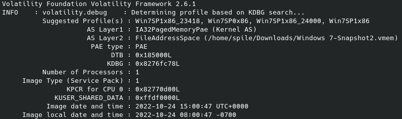
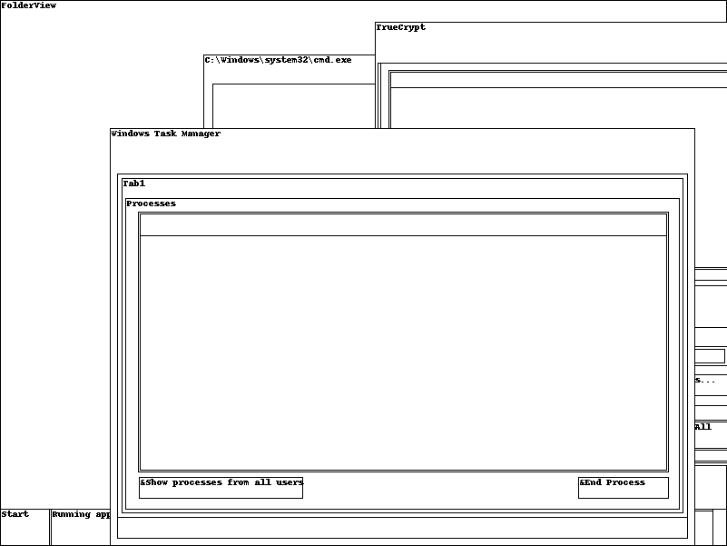
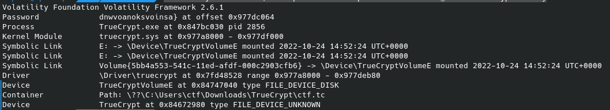
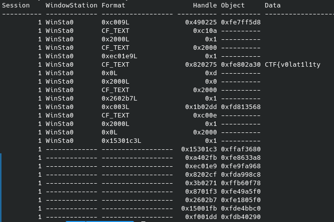

# kid forenstic

## **Описание:**
### Мы успели снять довольно занятный [дамп памяти](https://mega.nz/file/I3wSWTaL#vy9iDGaY8hxpTsJy1c1dCrk0U43vLsuxVbOfD9eWRpE). Изучите его.
# 
## **Флаг:**
### `CTF{v0lat1l1ty_intro_dnwvoanoksvoinsa}`
# 
## **Решение:**
#### Для начала нужно узнать какой профиль у нашего дампа(volatility -f image imageinfo)

#### Теперь мы знаем профиль, **Win7SP1x86_23418**, дальше для большего понимания делаем "скриншот" экрана и смотрим дерево процессов.
* #### volatility -f image --profile=Win7SP1x86_23418 screenshot  --dump-dir .

* #### volatility -f image --profile=Win7SP1x86_23418 pstree

#### Из данных полученных выше делаем вывод что у нас есть два интересных процесса: pscrypt и cmd
#### Проверим консольные команды:
* #### volatility -f image --profile=Win7SP1x86_23418 consoles в истории найдем _intro_

#### Далее посмотрим что у нас есть в truecrypt:
* #### volatility -f image --profile=Win7SP1x86_23418 truecryptsummary

#### И наконец проверим, может быть что то еще осталось в буфере обмена
* #### volatility -f image --profile=Win7SP1x86_23418 clipboard

#### Получаем флаг: `CTF{v0lat1l1ty_intro_dnwvoanoksvoinsa}`
