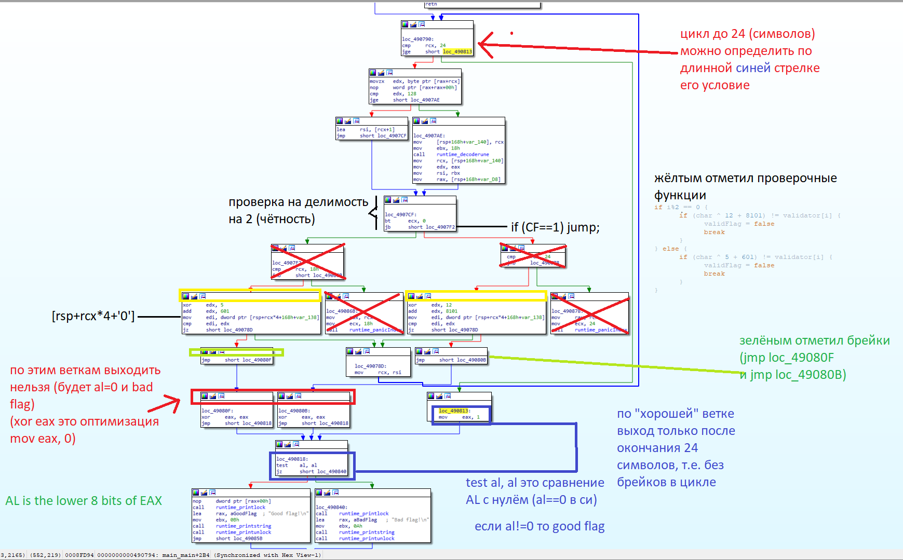
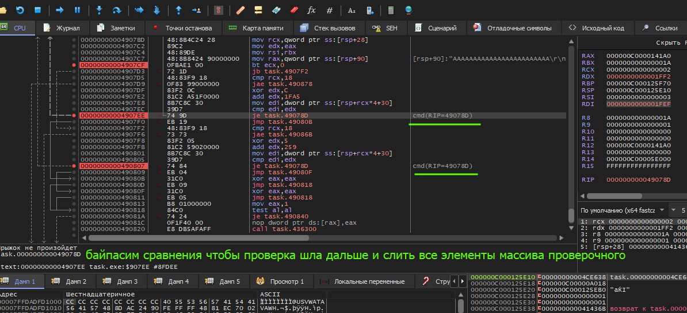
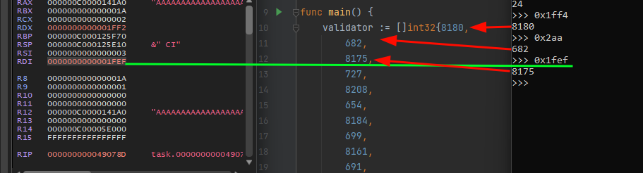

# Название: Я у мамы программист
## Описание:
Выучил новый язык, даже написал программу на нем и поставил защиту паролем. Поможешь его вспомнить?
### Флаг:
CTF{g0_g0_g0_!_6a70467c}
### Хинт:
Посмотрите в IDA адрес `0x4904E0`, функция main_main, декомпиляция, скорее всего, нормально не рабоатет (смотрите в виде ассемблера)
### Решение:
Ассемблерный граф:

Понимаем алгоритм, что для символов на четных позициях используется `(char ^ 12 + 8101)`,
на нечётных `(char ^ 5 + 601)`.
Далее дампим массив проверки, лично я забил копаться в асме и просто сдампил в динамике (x64dbg) через регистр:

Есть еще один вариант решения, отчасти более простой, но надо больше знать:
https://github.com/ChrisTheCoolHut/PinCTF  
https://github.com/ChrisTheCoolHut/PinCTF/issues/15 - попытка портировать на Windows  
Называется timing attack, суть в подборе флага по одному символу 
(чем больше правильных, тем больше инструкций исполнится, так как на неправильных сразу ид
